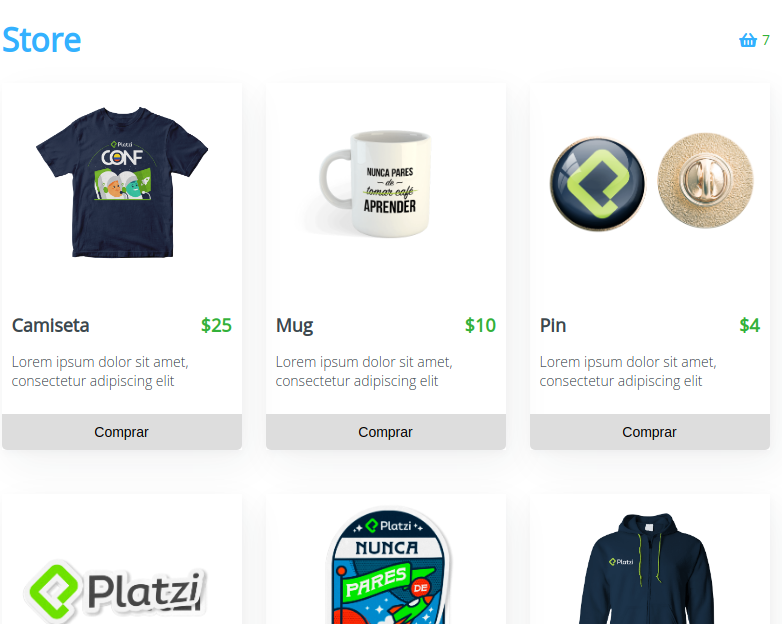
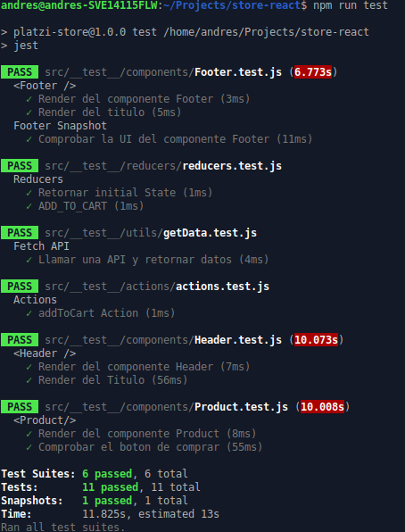

# Store

Tienda virtual implementada con React para realizar pruebas unitarias

## Herramientas usadas

- Pruebas unitarias con Jest

## ¿Cómo funciona?

Requiere Node.JS 10

- `npm install` para instalar las dependencias.

- `npm start` para el entorno de desarrollo.

- `npm run build` para generar app de producción.

- `npm run test` para ejecutar pruebas.

## Licencia

MIT
